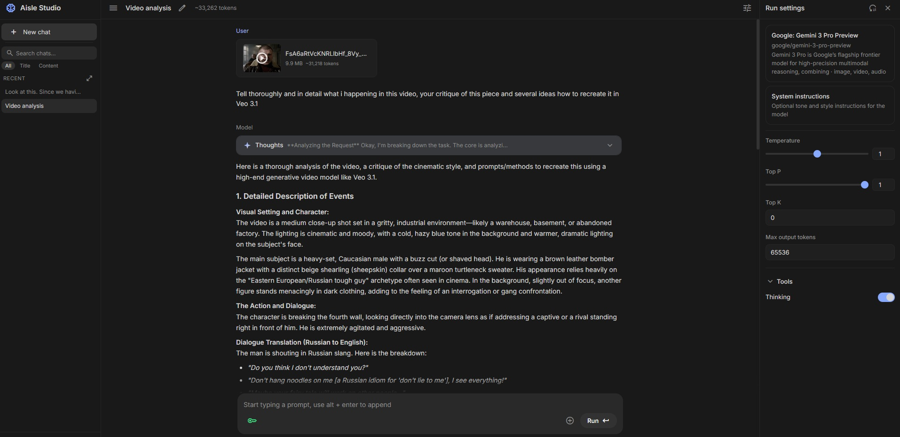

# Aisle Studio

A local chat UI that mimics AI Studio style, backed by FastAPI and OpenRouter.



## What It Does

- Multi-chat workspace with local JSON persistence
- Streaming model responses (SSE)
- Provider/model settings from `static/providers.json`
- Attach files to prompts (image/video/audio/text/pdf)
- Search chat history (title/content/all)

## Run

```bash
pip install -r requirements.txt
python main.py
```

Open: `http://127.0.0.1:8765`

## API Key

Use the key button in the prompt bar, or set env vars in `.env` (for example `OPENROUTER_API_KEY`).

## Data Layout

- Chats: `data/chats/{chat_id}.json`
- Uploaded files: `data/chats/{chat_id}/files/*`
- Saved key overrides: `data/keys.json`

## Main Files

- Backend: `main.py`
- Frontend shell: `static/index.html`
- Frontend logic: `static/js/*.js`
- Styles: `static/css/style.css`
- Model registry: `static/providers.json`

## Disclaimer

Built for personal use first. It is intentionally simple, and there are probably rough edges and bugs.
